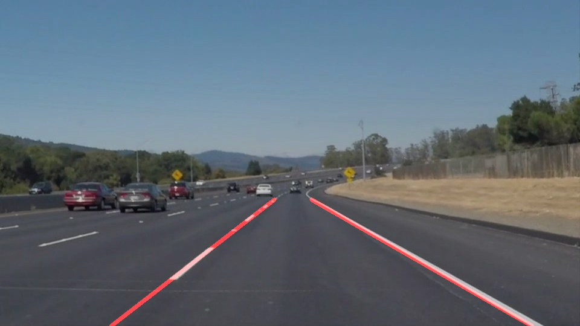
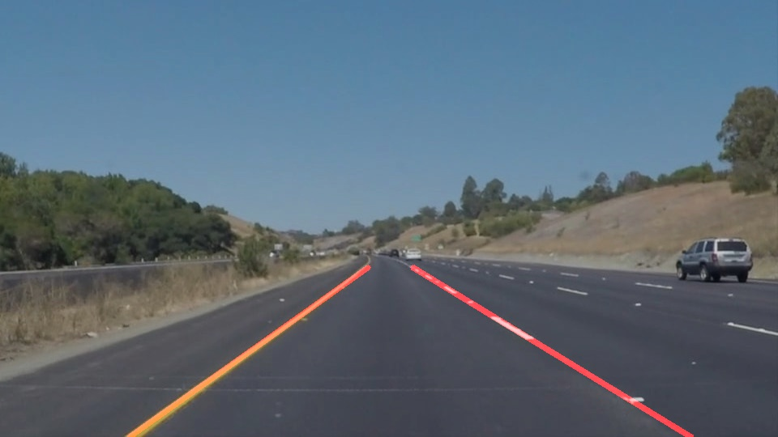
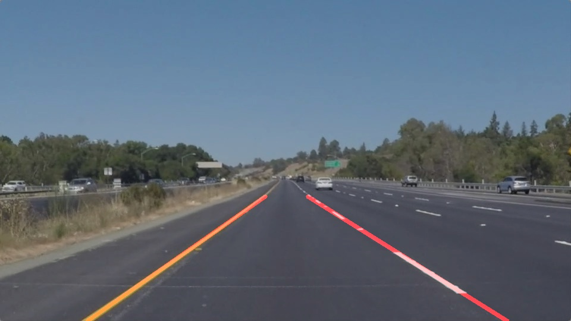
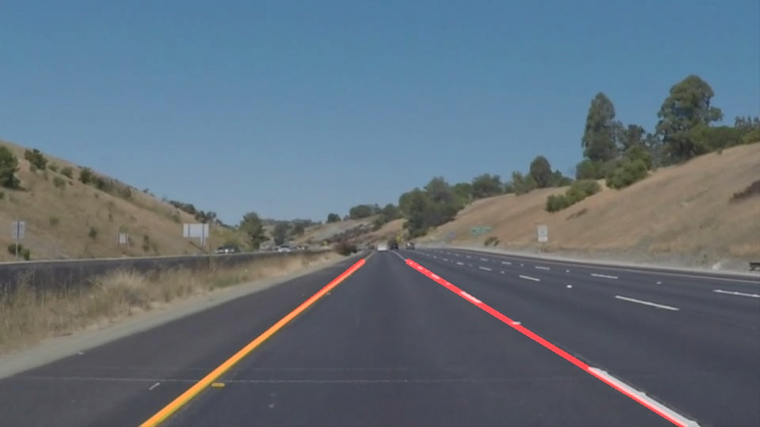
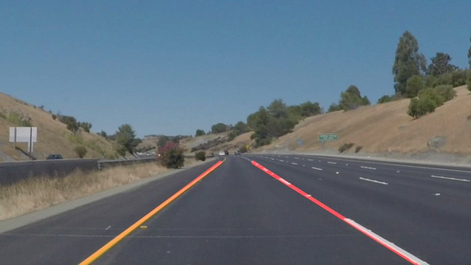
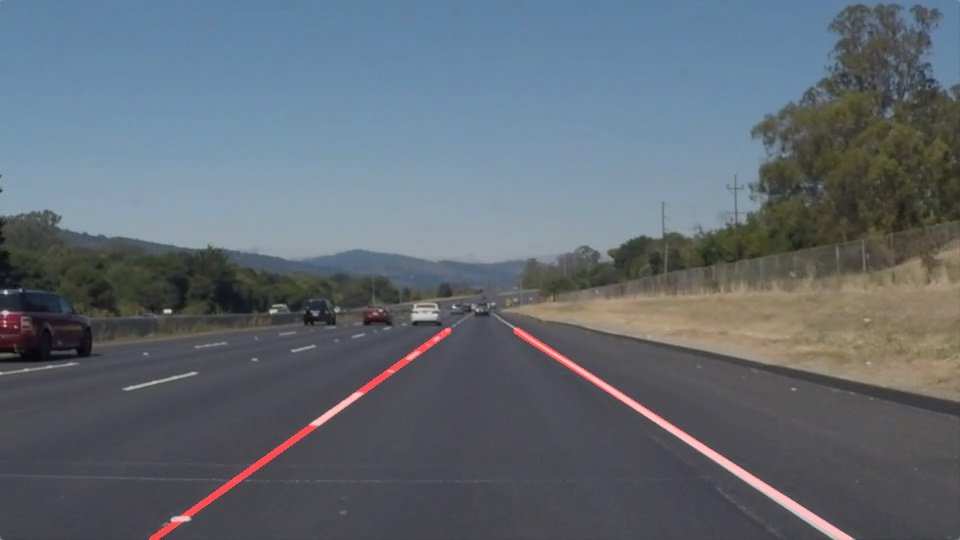

# **Finding Lane Lines on the Road**

## Khaled Zoheir Writeup: [email:](mailto:khaled.zoheir.kz@gmail.com)

---

**Finding Lane Lines on the Road**

The goals / steps of this project are the following:
* Make a pipeline that finds lane lines on the road
* Reflect on your work in a written report

[//]: # (Image References)
 "Grayscale"

---

### Reflection

### 1. Pipeline. As part of the description, explain how you modified the draw_lines() function.

My pipeline consisted of 5 steps. First, I converted the images to:
* grayscale [no parameters
* gaussian parameter: gaussian_kernel_sizes
* * tried [3, 5, 7,9,11]:
* canny [canny_low_threshold, canny_high_threshold]
* * tried: [50,150] to [100,300] steps [10, 30]
* mask the region of interest:
* * tried different ones till fixing:  [(150,530),(450,310),(490,310),(850,500)]
* hough lines :
* * rhos = [1, 2, 3]
* * thetas = [1, 6, 11, 16, 21, 26, 31, 36, 41, 46, 51, 56, 61] degrees
* * threshold = 15 # minimum number of votes (intersections in Hough grid cell)
* * min_line_len = 2 #minimum number of pixels making up a line
* * max_line_gap = 40 # maximum gap in pixels between connectible line segments

### Notes:
* * All parameters started with a default value. Each step and according to the visual inspection we determine the appropriate values
* * In order to go through the process set: Find_Best_Parameters=TRUE. Otherwise it uses the resultant values.
* * When Find_Best_Parameters=TRUE is set to true a lot of images are produced to compare the results

## 2. draw_lines:
* We need 2 lines left and right lanes:
* * One from the lines with +ve slope (left line)
* * The second with the lines with -ve slope (right line).
* * Ignore lines parallel to the y-axes: (very little diff in x)

In order to draw a single line on the left and right lanes, I modified the draw_lines() function by trying different techniques:
1. Average slope and Y-Intercepts of lines (2 lines: +ve and -ve slopes)
2. Best fit of the points forming the lines (each line contribute by 2 points) [Not done. 3 is better]
3. Best fit of points along the lines. Each line contribute with at least 2 points. It could be more depending on the length of the line
4. Segments Best fit: Only consider the lines with y lies in the lower half of the region of interest
Note: Only method 3 has been tested so far. Other may even result in a syntax error

# Results:

### 2. Identify potential shortcomings with your current pipeline

* * This will only detects 2 lines. 1 on the left and one on the right. It will not produce many lines on 1 side. Moreover, many lines could result in a bad lines Detection

* * Very prone to line colors. It works only with white lines and with less extent with yellow Lines

* * Curved lines are not properly covered.

* * A lot of investigation is needed to come up with the best parameters and best draw_lines method.

### 3. Suggest possible improvements to your pipeline

* * Curved lines: Use quadratic polyfit instead of linear polyfit
