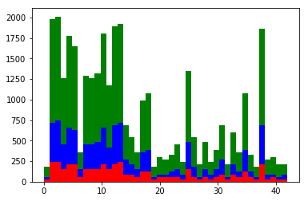
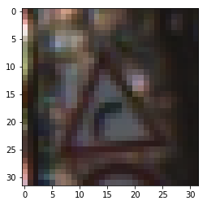
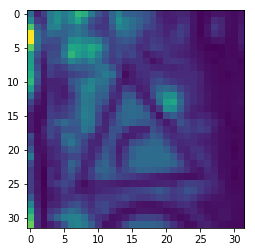
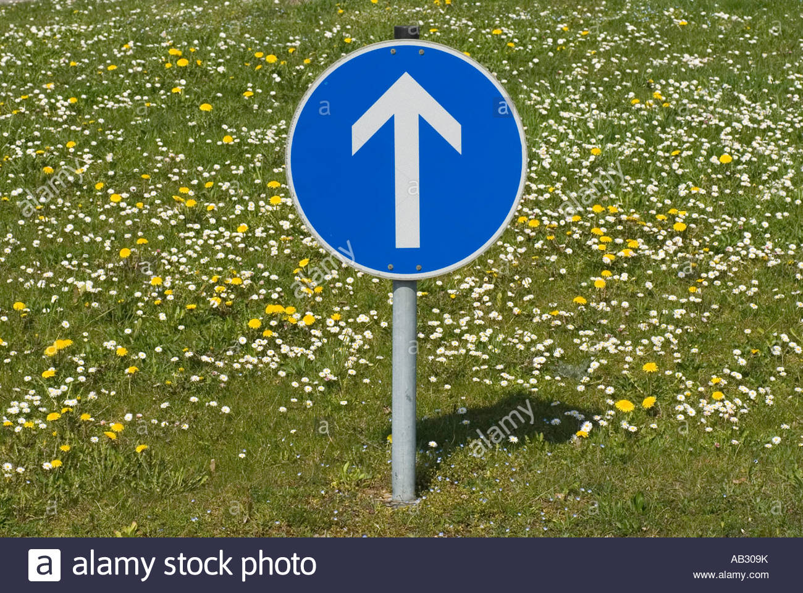
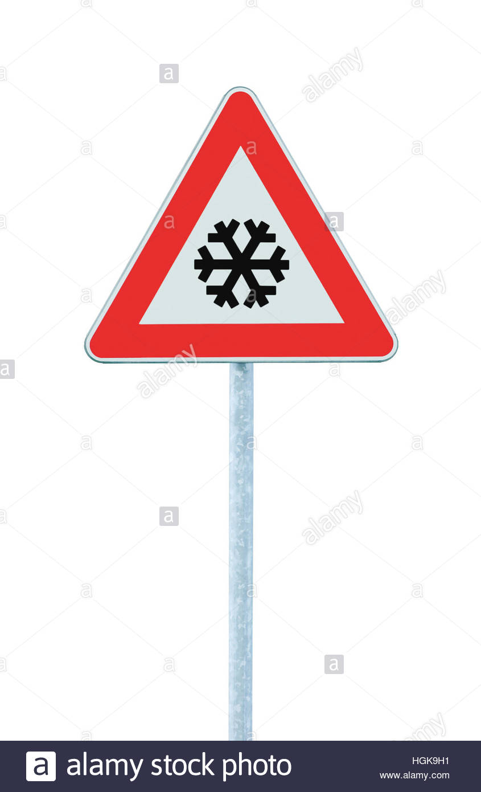
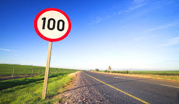

# **Traffic Sign Recognition**

## Khaled Zoheir - P2: [email:](mailto:khaled.zoheir.kz@gmail.com)

## Writeup

**Build a Traffic Sign Recognition Project**

The goals / steps of this project are the following:
* Load the data set (see below for links to the project data set)
* Explore, summarize and visualize the data set
* Design, train and test a model architecture
* Use the model to make predictions on new images
* Analyze the softmax probabilities of the new images
* Summarize the results with a written report

[//]: # (Image References)

 "Grayscaling"

## Rubric Points
### Here I will consider the [rubric points](https://review.udacity.com/#!/rubrics/481/view) individually and describe how I addressed each point in my implementation.  

---
### Writeup / README

### Data Set Summary & Exploration

#### 1. Basic summary of the data set.

I used the pandas library to calculate summary statistics of the traffic
signs data set:

* Number of training examples = 34799
* Number of testing examples = 12630
* Number of validation examples = 4410
* Image data shape = (32, 32, 3)
* The number of unique classes/labels in the data set is 43

#### 2. Exploratory visualization of the dataset.

Here is an exploratory visualization of the data set. It is a bar chart showing how the data is split between:

Training (Green),
Validation (Red)
and testing (Green)

 "Histogram of datasets"

### Design and Test a Model Architecture

#### 1. Preprocessing

-  ### Convert to grayscale:
- - No need for the color component.
- - Using RGB images consume more time than gray-scale image ( Decreasing data to one third )
- - Color images will requires more sophisticated network to get the same accuracy

Here is an example of a traffic sign image before and after grayscaling:

 "Colored Traffic Sign"

 "Grayed Traffic Sign"

-  ### Normalize the images:
Normalized the data from: 0-255 range to 0.1-0.9. Accuracy is better with lower range than with a larger one.

-  ### Augmenting the dataset:
Augmenting the dataset (generate new data from existing ones) will result in:
- - Higher accuracy specially with real traffic signs as the real signs may be distorted
- - Higher testing accuracy as we will use more data for training, thus we can increase the epochs without overfitting and accordingly get a better training and validation accuracy

- ### Possible techniques for augmenting the dataset:
- #### Note: I didn't have time to try those techniques. I might apply them and re-submit.
- - Tile the images once to the right and once to the left.
- - Add some noise to the images: Gaussian noise.

#### 2. Model Architecture:

My final model consisted of the following layers:

| Layer         		|     Description	        					|
|:---------------------:|:---------------------------------------------:|
| Input         		| 32x32x3 BGR image   							|
| Layer 1 - Convolution 5x5     	| 1x1 stride, same padding, outputs 28x28x6 	|
| RELU					|												|
| Ave pooling	      	| 2x2 stride,  outputs 14x14x6 				|
| Layer 2 - Convolution 5x5     	| 1x1 stride, same padding, outputs 10x10x16 	|
| RELU					|												|
| Ave pooling	      	| 2x2 stride,  outputs 5x5x16 				|
| Layer 3 - Fully connected		| 400 - > 200        									|
| RELU					|												|
| Drop out		| keep_prob = 0.5        									|
| Layer 4 - Fully connected		| 200 - > 100        									|
| RELU					|												|
| Drop out		| keep_prob = 0.5        									|
| Layer 5 - Fully connected		| 100 - > 43        									|
| RELU					|												|
| Softmax				|         									|
|						|												|
|						|												|

To acheive the desired accuracy, I increase the first 2 fully connected layers from: 400x120 and 120x84 to 400x200 and 200x100

#### 3. Training Model:
- - Optimizer: Choose Adam optimizer "AdamOptimizer". This is the most commonly used one.
- - Batch size: 100. Tried 150 and there was overfitting. Reduced it to 100
- - Number of epochs: 25. Tried 10 to 20. Accuracy not good enough. 25 do not produce overfitting
- - Learning rate: 0.001. Started with 0.005 and  decreased to 0.001 to get the proper accuracy
- - keep_prob: 0.5. Better results than 0.7

To train the model, I used: AdamOptimizer, Batch size = 100, Number of epochs = 25, mu=0 , sigma=0.1, Learning rate = 0.001 and keep_prob: 0.5

#### 4. Solution Approach:
- - Used LeNet architecture as the basic architecture.
- - - Monitored: Validation accuracy to be at the required level (>0.93)
- - - Monitored: Overfitting by making sure that the validation accuracy doesn't increase or fluctuate in the last few epochs.
- - - In case of Overfitting or unsatisfactory accuracy:
- - - - Modify the network architecture. Mainly increase the size of the fully connected layers
- - - - Modify the dropout probability. Tried 0.7 and 0.5
- - - - Lower the training rate in case of bad accuracy
- - - - Increase the number of epochs to get better accuracy and decrease it to avoid overfitting
- - - - Increase the batch size to get better accuracy and decrease it to avoid overfitting

Here are some of the test done and the corresponding actions:
- Tests results: Parameters then accuracy of last 4 epochs
- - EPOCHS = 10, BATCH_SIZE = 150, rate = 0.005, KEEP_PROBA = 0.7 ==> 0.936, 0.938, 0.939, 0.937 ==> Decrease rate
- - EPOCHS = 10, BATCH_SIZE = 150, rate = 0.001, KEEP_PROBA = 0.7  ==> 0.880, 0.878, 0.895, 0.906 ==> Increase EPOCHS
- - EPOCHS = 20, BATCH_SIZE = 150, rate = 0.001, KEEP_PROBA = 0.7  ==> 0.917, 0.931, 0.930, 0.927 ==> rate has little impact. Try BATCH_size
- - EPOCHS = 20, BATCH_SIZE = 100, rate = 0.005, KEEP_PROBA = 0.7  ==> 0.937, 0.935, 0.923, 0.938 ==> Decrease keep_prob
- - EPOCHS = 25, BATCH_SIZE = 100, rate = 0.001, KEEP_PROBA = 0.5  ==> 0.952, 0.948, 0.952, 0.949 ==> Good enough results.

My final model results were:
* training set accuracy of: 0.989
* validation set accuracy of: 0.931
* test set accuracy of: 0.931

### Test a Model on New Images

#### 1. Choose five German traffic signs found on the web and provide them in the report. For each image, discuss what quality or qualities might be difficult to classify.

Here are five German traffic signs that I found on the web:
 "Ahead only"
 "Beware of ice/snow"
 "Speed limit (100km/h)"
 "Turn left ahead"
 "Yield"

The first three images might be difficult to classify because they will be squeezed to 32x32x3.

#### 2. Model's predictions on real traffic signs:

Here are the results of the prediction:

| Image			        |     Prediction	        					|
|:---------------------:|:---------------------------------------------:|
| Ahead only      		| Road work   									|
| Beware of ice/snow     			| No entry 										|
| Speed limit (100km/h)					| Stop											|
| Turn left ahead	      		| Turn left ahead					 				|
| Yield			| Yield      							|

The model was able to correctly guess 2 of the 5 traffic signs! which gives an accuracy of 40%. This compares favorably to the accuracy on the test set of 0.953

#### 3. Model Certainty:

For the first 3 images, the model is totally off! I even got a (-ve probability!!)

First image: Ahead only

| Probability         	|     Prediction	        					|
|:---------------------:|:---------------------------------------------:|
| .80         			| Road work   									|
| .07     				| Speed limit (60km/h) 										|
| .04					| Speed limit (80km/h)											|
| .02	      			| Speed limit (50km/h)					 				|
| .02				    | No passing for vehicles over 3.5 metric tons      							|

| Probability         	|     Prediction	        					|
|:---------------------:|:---------------------------------------------:|
| 1.0         			| No entry   									|
| .00     				| Stop 										|
| .00					| Speed limit (20km/h)											|
| .00	      			| Roundabout mandatory					 				|
| .00				    | Priority road      							|

Third image: Speed limit (100km/h)
| Probability         	|     Prediction	        					|
|:---------------------:|:---------------------------------------------:|
| .95         			| 'No entry   									|
| .04     				| Stop 										|
| .004					| Traffic signals											|
| .0004	      			| Turn right ahead					 				|
| .0002			    | Keep right      							|

Forth image: Turn left ahead
| Probability         	|     Prediction	        					|
|:---------------------:|:---------------------------------------------:|
| .66         			| Turn left ahead   									|
| .34     				| Keep right 										|
| .00					| No vehicles											|
| .00	      			| Yield					 				|
| .00				    | No entry      							|

Fifth image: Yield
| Probability         	|     Prediction	        					|
|:---------------------:|:---------------------------------------------:|
| 1.00         			| Yield   									|
| .00     				| No passing 										|
| .00					| Ahead only											|
| .00	      			| Children crossing					 				|
| .00				    | Turn left ahead      							|
