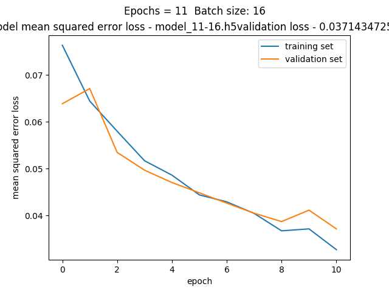
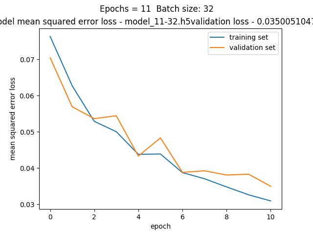
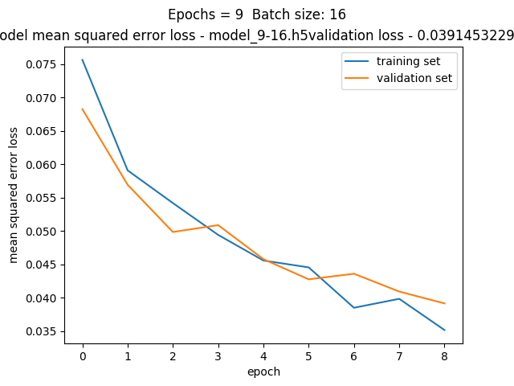
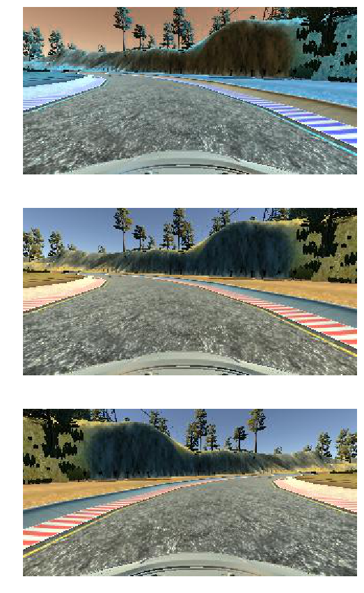

# **Behavioral Cloning**

## Khaled Zoheir - P3: [email:](mailto:khaled.zoheir.kz@gmail.com)

## Writeup

---

**Behavioral Cloning Project**

The goals / steps of this project are the following:
* Use the simulator to collect data of good driving behavior
* Build, a convolution neural network in Keras that predicts steering angles from images
* Train and validate the model with a training and validation set
* Test that the model successfully drives around track one without leaving the road
* Summarize the results with a written report


### Files Submitted & Code Quality

#### 1. Submission includes all required files and can be used to run the simulator in autonomous mode

My project includes the following files:
* model.py containing the script to create and train the model
* drive.py for driving the car in autonomous mode
* model.h5 containing a trained convolution neural network
* writeup_report.md summarizing the results

#### 2. Submission includes functional code
Using the Udacity provided simulator and my drive.py file, the car can be driven autonomously around the track by executing
```sh
python drive.py model.h5
```
#### 3. Submission code is usable and readable

- The model.py file contains the code for training and saving the convolution neural network.
- The file shows the pipeline I used for training and validating the model, and it contains comments to explain how the code works.

### Model Architecture and Training Strategy

#### 1. An appropriate model architecture has been employed

My model is the already exiting: NVidia model.

The model includes RELU layers to introduce nonlinearity, and the data is normalized in the model using a Keras lambda layer.

#### 2. Attempts to reduce overfitting in the model
- Monitored the training loss: Visualization and ensure that the loss on the validation set is still decreasing in the last epochs.
- I detect overfitting When the loss is decreasing on the Training set and Incresing on the validation set.
- In this case and in order to reduce overfitting I've done the following:
- - Modified the model so that decrease no. of epochs
- - Use more training data from both tracks.
- - Augment the data (flip the camera , use right an left cameras by adding or subtracting a 0.2 correction for the measurments)

- The model was trained and validated on different tracks to ensure that the model was not overfitting.
- The model was tested by running it through the simulator and ensuring that the vehicle could stay on the track.

- Two main training were done to determine an appropriate batch size (16 or 32) and appropriate number of epochs.





##### Accordingly batch size = 16 and epochs = 0 were chosen. Although the 32 batch size resulted in a lower loss however, the batch size 16 is more consistent:





Note: In the plot. The epoch axes shows (epochs -1). So 8 on the axe means 9 epochs!

#### 3. Model parameter tuning

The model used an Adam optimizer, so the learning rate was not tuned manually.

#### 4. Appropriate training data

Training data was chosen to keep the vehicle driving on the road. I used a combination of center lane driving, recovering from the left and right sides of the road, train on 2 tracks, and drove in reverse of the tracks

For details about how I created the training data, see the next section.

### Model Architecture and Training Strategy

#### 1. Solution Design Approach

The overall strategy for deriving a model architecture was to use a well know proven model for the project

My first step was to use a convolution neural network model similar to the nVidea model. I thought this model might be appropriate because they are the ones prompting Behavioral clowning for end to end self driving

In order to gauge how well the model was working, I split my image and steering angle data into a training and validation set. I found that my first model had a low mean squared error on the training set but a high mean squared error on the validation set. This implied that the model was overfitting.

To combat the overfitting, I modified the model so that it has less number of epochs

The final step was to run the simulator to see how well the car was driving around track one. There were a few spots where the vehicle fell off the track. to improve the driving behavior in these cases, I augmented that data and drove more on both tracks in both directions. Also, I created recovery scenarios when the car is near the edge

At the end of the process, the vehicle is able to drive autonomously around the track without leaving the road.

#### 2. Final Model Architecture

My final model consisted of the following layers:

| Layer Num. | Layer         		   |     Kernel / Filters no. | Activation	 |Output shape   					|
|:---------------------:|:---------------------------------------------:|
| Layer 1 | Convolution      	| 5*5 / 24 | Relu |  (43,158,24) 	|
| Layer 2 | Convolution      	| 5*5 / 36 | Relu |  (20,77,36) 	|
| Layer 3 | Convolution      	| 5*5 / 48 | Relu |  (8,37,48) 	|
| Layer 4 | Convolution      	| 5*5 / 64 | Relu |  (6,35,64) 	|
| Layer 5 | Convolution      	| 5*5 / 64 | Relu |  (4,33,64) 	|
| Layer 6 | Flatten      	| converts convert from 3D to 1D array | None |  8448 	|
| Layer 7 | Fully connected      	| Dense(100) | None |  8448 	|
| Layer 8 | Fully connected      	| 5*5 / 64 | Relu |  100 	|
| Layer 9 | Fully connected      	| 5*5 / 64 | Relu |  10 	|
| Layer 10 | Fully connected      	| 5*5 / 64 | Relu |  1 	|

#### 3. Creation of the Training Set & Training Process

To capture good driving behavior, I first recorded two laps on track one using center lane driving.
I then recorded the vehicle recovering from the left side and right sides of the road back to center
so that the vehicle would learn to give the appropriate steering angle in this case. Then I repeated
this process on track two in order to get more data points.

To augment the data sat, I also flipped images and angles thinking that this would generalize the
training.

#### Here is an example of my data:

The next 3 images are taken using image_generator.py file:
* A sample from my training data.
* The sample after converting color space to RGB.
* The sample after flipping the image.



After the collection process, I had 33417 number of data points. I randomly shuffled the data set
and put 20% of the data into a validation set using train_test_split function from
sklearn.model_selection . So, the validation data points are 6684 .

I used this training data for training the model. The validation set helped determine if the model was
over or under fitting. The ideal number of epochs was 9. I used an adam optimizer so that manually
training the learning rate wasn't necessary.

### Attempts to reduce overfitting in the model
* The model was trained and validated on different data sets to ensure that the model was
not overfitting.
* Choosing the best batch_size :16, I tried 32 and the validation loss was not consistent.
* Choosing the best no. Of epochs :9, I tried 11 and there was overfitting.

* The model was tested by running it through the simulator and ensuring that the vehicle
could stay on the track.
