# **Advanced Lane Finding**

## Khaled Zoheir - P4: [email:](mailto:khaled.zoheir.kz@gmail.com)

## Writeup

---

** Goals**

The goals / steps of this project are the following:

* Compute the camera calibration matrix and distortion coefficients given a set of chessboard images.
* Apply a distortion correction to raw images.
* Use color transforms, gradients, etc., to create a thresholded binary image.
* Apply a perspective transform to rectify binary image ("birds-eye view").
* Detect lane pixels and fit to find the lane boundary.
* Determine the curvature of the lane and vehicle position with respect to center.
* Warp the detected lane boundaries back onto the original image.
* Output visual display of the lane boundaries and numerical estimation of lane curvature and vehicle position.

[//]: # (Image References)
# Final lane detection for the test images

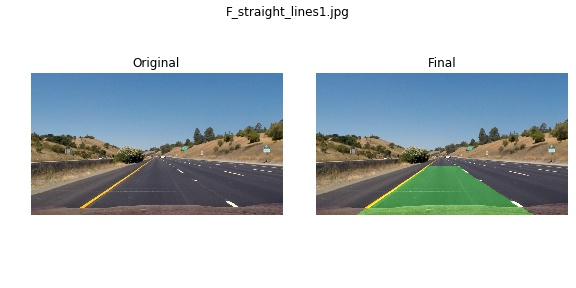
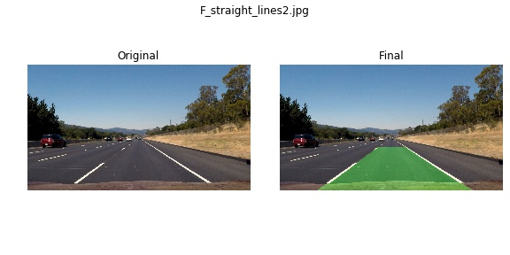
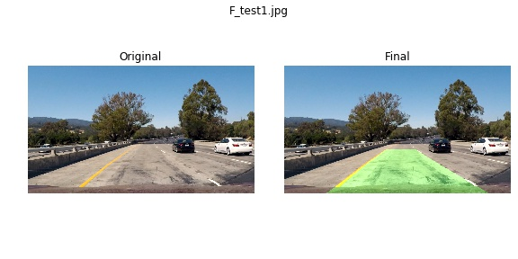
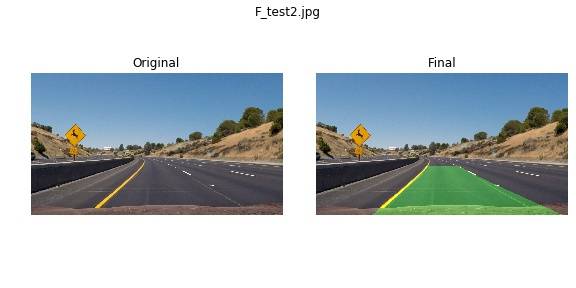
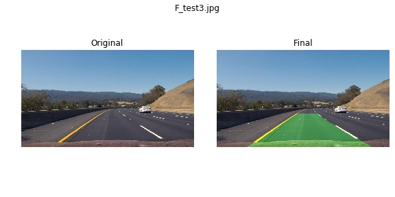
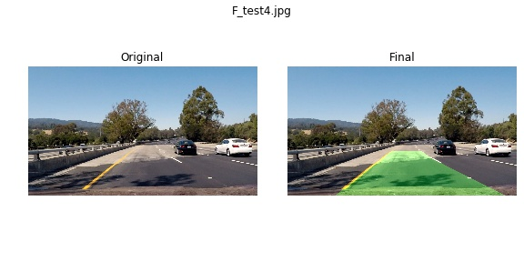
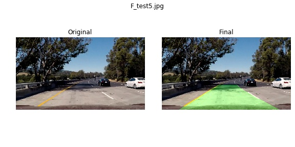
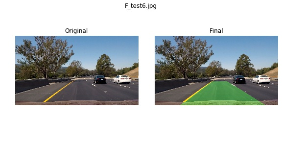

# Pipeline images on test1.jpg

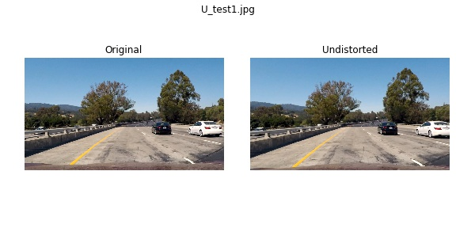 "Undistorted"
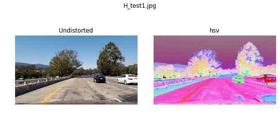 "Road Transformed"
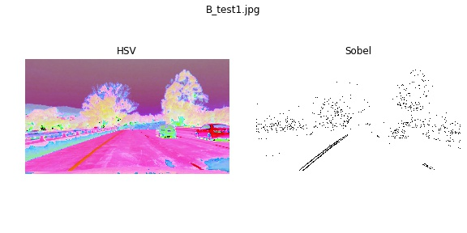 "Binary Example"
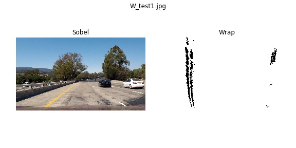 "Warp Example"
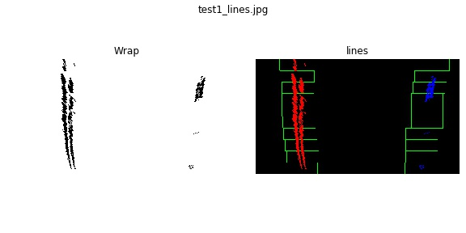 "Fit Visual"
 "Output"

 "Video"

## [Rubric](https://review.udacity.com/#!/rubrics/571/view) Points

### Here I will consider the rubric points individually and describe how I addressed each point in my implementation.  

---

### Writeup

The code is in 2 jupyter files called:
* "./P4-Advanced Lane Finding-Calibration" for camera calibration and
* "./P4-Advanced Lane Finding.ipynb" for the Undestort, pipeline and video

There is also a third file: "./P4-Advanced Lane Finding-Find perspective coordinates" that was temporally used to get the perspective lines.

The first cell in the file describes all the parameters used:
# Parameters:

## Sobel
* sobel_kernel_size = 9
* dir_thresh  = (0.7, 1.2)
* sx_thresh = (20, 100)
* sy_thresh = (65, 150)
* mag_thresh = (170, 255)

## Bird eye view:

* * src_leftlowerpoint  = [260,680]
* * src_leftupperpoint  = [568,470]
* * src_rightlowerpoint = [1043,680]
* * src_rightupperpoint = [717,470]

* * dst_leftlowerpoint  = [260,680]
* * dst_leftupperpoint  = [200,0]
* * dst_rightlowerpoint = [1000,680]
* * dst_rightupperpoint = [1000,0]

## Line fitting:

* n_windows = 10  # 10
* margin = 100   # Determines how wide the window is
* minpix = 40    # Set minimum number of pixels found to recenter window

### Camera Calibration

#### 1. Camera matrix and distortion coefficients computation.
 Provide an example of a distortion corrected calibration image.

- Preparing "object points": `objpoints`
- - Same chessboard for all images.
- - Prepared an `objp` which is the (x, y, z) coordinates of the chessboard corners in the world. Here I am assuming the chessboard is fixed on the (x, y) plane at z=0, such that the object points are the same for each calibration image.
- - Produced `objpoints` by replicating `objp` for all images.
- Preparing "image points": `imgpoints`
- - `imgpoints` will be appended with the (x, y) pixel position of each of the corners in the image plane with each successful chessboard detection.  

- Camera calibration:
- - I then used the output `objpoints` and `imgpoints` to compute the camera calibration and distortion coefficients using the `cv2.calibrateCamera()` function.
- - I applied this distortion correction to the test image using the `cv2.undistort()` function and obtained this result:

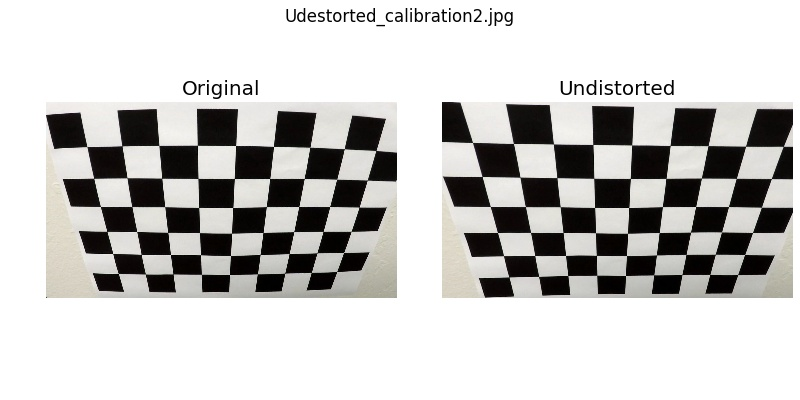 "Corrected Image"

### Pipeline (single images)
# Rubric 2: Pipeline code
* code near the bootm of the file at: [19] and [20]
* * [20] pipeline starting from an image file name
* * [19] pipeline startign from an image:
* * * img_undistorted = undistortImage(img)
* * * hsv = colorConvert (img_undistorted)
* * * binaryImage = sobelBinaryHSVImage(hsv, sobel_kernel_size, mag_thresh, sx_thresh)
* * * warped, M  = birds_eye_view(binaryImage)
* * * histo = get_histogram(warped)
* * * img_lines, radius, offset, l_fit, r_fit, ploty = fit_2_lanes(warped, histo)
* * * final_output = draw_lane(img, img_lines, M, l_fit, r_fit, ploty)

* * Note, the pipeline includes display parameters and annotation parameter (for the video)

#### 1. Provide an example of a distortion-corrected image.
Two steps are needed to correct a distorted image:
- Retrieve the camera calibration parameters (if not there already): ret, mtx, dist, rvecs, tvecs (only mtx and dist are important for us)
- - pickle.dump( { 'mtx': mtx, 'dist': dist }, open('./camera_calibration.p', 'wb'))
- - dist_pickle = pickle.load( open( "./camera_calibration.p", "rb" ) ); mtx = dist_pickle["mtx"]; dist = dist_pickle["dist"]
- - code: in [8] and [9] # Rubric 2-0: Pre-Pipeline - Load camera parameters

- Use the open cv function: `cv2.undistort()` and pass the calibration parameter along with the distorted image to generate the undistorted image
- - code: in [10] ] # Rubric 2-1: Pipeline - Distortion correction

To demonstrate this step, I will describe how I apply the distortion correction to one of the test images like this one:
 "Undistorted"

#### 2. Describe how (and identify where in your code) you used color transforms, gradients or other methods to create a thresholded binary image.  Provide an example of a binary image result.

I first transformed the image to hsv `cv2.cvtColor(img, cv2.COLOR_RGB2HLS).astype(np.float)`

Then I used a combination of color and gradient thresholds to generate a binary image:
* code at: # Rubric 2-2: Pipeline - Color transforms and # Rubric 2-3: Pipeline - Sobel x gradients and color thresholdeds binary image [11] and [12]

Here's an example of my output for this step.
 "Road Transformed"
 "Binary Example"

#### 3. Describe how (and identify where in your code) you performed a perspective transform and provide an example of a transformed image.

The code for my perspective transform includes a function called `birds_eye_view()`,  which appears at: # Rubric 2-4: Pipeline - Bird eye view: fixed polygone cell[13].

Since the camera is fixed on the car. We can determine the vanishing point for the camera and get a `src` polygon. Accordingly, I chose the hard-code the source and destination points in the following manner:

For this a separate file was used to determine this point: `P4-Advanced Lane Finding-Find perspective coordinates`: The result is depicted in the following image: "The folder:./output_images/perspective includes the perspective of the test images "

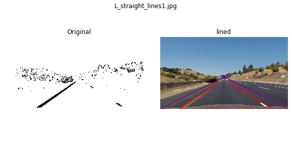 "Vanishing point"

Output example from perspective in the pipeline:
 "Warp Example"

#### 4. Describe how (and identify where in your code) you identified lane-line pixels and fit their positions with a polynomial?
* Code at: # Rubric 2-5: Pipeline - Display the histogram and # Rubric 2-6: Pipeline - fit 2 lanes [14] and [15]
* Thresholds used are in the `parameters` cell

Output image (histogram then thresholds):

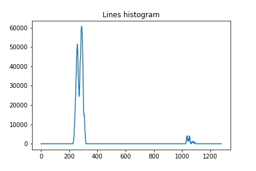 "histgram"

 "Fit Visual"

#### 5. Describe how (and identify where in your code) you calculated the radius of curvature of the lane and the position of the vehicle with respect to center.

Code at: # Rubric 2-6: Pipeline - fit 2 lanes [15]. Just before the return

#### 6. Provide an example image of your result plotted back down onto the road such that the lane area is identified clearly.
 "Output"

### Pipeline (video)

#### 1. Provide a link to your final video output.  Your pipeline should perform reasonably well on the entire project video (wobbly lines are ok but no catastrophic failures that would cause the car to drive off the road!).

Here's a [link to my video result](./output_video/project_video.mp4)

---

### Discussion

#### 1. Briefly discuss any problems / issues you faced in your implementation of this project.  Where will your pipeline likely fail?  What could you do to make it more robust?

* More tests are needed. I already noticed a problem in the shade. This might be resolved by tuning the parameters and taking more channels than the 'S' channel
