# **Vehicle detection**

## Khaled Zoheir - P5: [email:](mailto:khaled.zoheir.kz@gmail.com)

## Writeup
**Files**
2 files are provided.
* The first: `P5-Vehicle_detection` is the main file with the selected parameters
* The second: `P5-Vehicle_detection-Model Parameters Tuning` is used to test the impact of different parameters settings on the model fitting accuracy

**Vehicle Detection Project**

The goals / steps of this project are the following:

* Reading dataset
* Extracting Features
* Training a classifier
* Sliding Window Search
* Improving Sliding Window Search
* Video Implementation
* Discussion
--------------------------------
## Reading dataset:
The code for this step is contained in the cells(2) of the IPython notebook. The cell only gets the file names. reading the data is done when needed. E.g.: in cell [3] when displaying the sample images and in cell [6] to extract the features of each image.

#### Visualizing dataset: cell [3]
Taking 3 random images for `cars` and 3 random images for `notcars`
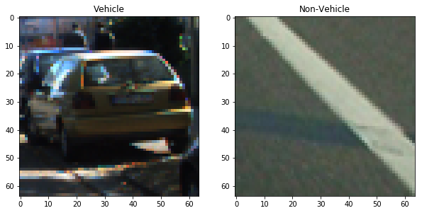

--------------------------------
## Extracting Features:

The code for this step is contained in the cells(4 and 6) of the IPython notebook

To identify vehicles in an image, we need "signature." for it. To create the vehicle signature, I extracted three different feature-sets:
* Spatial Features
* Color Histogram Features
* HOG (Histogram of Oriented Gradients) Features

* Spatial Features: Spatial features are the image pixel values after resizing and flattening the image.
* Color Histogram Features: A color histogram totals the number of pixel values that fall into evenly-distributed bins for each color channel. I chose to use 32 color bins parameter .

* HOG (Histogram of Oriented Gradients) Features: I extracted HOG features from the training images with Udacity course function
using the following parameters:
* * orient_param=9
* * pix_per_cell_param=8
* * cells_per_block_param=2

* * HOG visualization for car and non car:
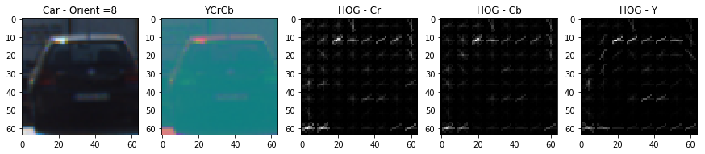
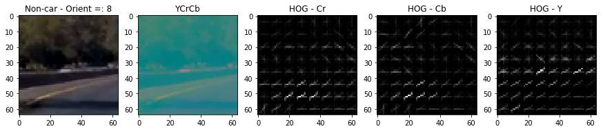

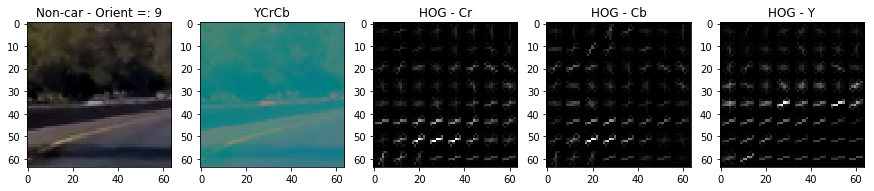

--------------------------------
## Training a classifier:
The code for this step is contained in the cells(8-99-10) of the IPython notebook

I trained a linear SVM using the provided data set of vehicle – non-vehicle images.

For each image we wish to train our machine learning classifier on, these features will be extracted and concatenated together to form the image's vehicle "signature."

The features were
normalized before being passed in to the classifier by StandardScaler.

I trained a Linear SVM classifier on 8791 car images and 8968 non-car images.

The test results showed over 99% accuracy.

Feature extraction parameters: cell (7)
I tried various combinations of parameters. The second file  `P5-Vehicle_detection-Model Parameters Tuning` shows the impact of different parameters on the model test accuracy.

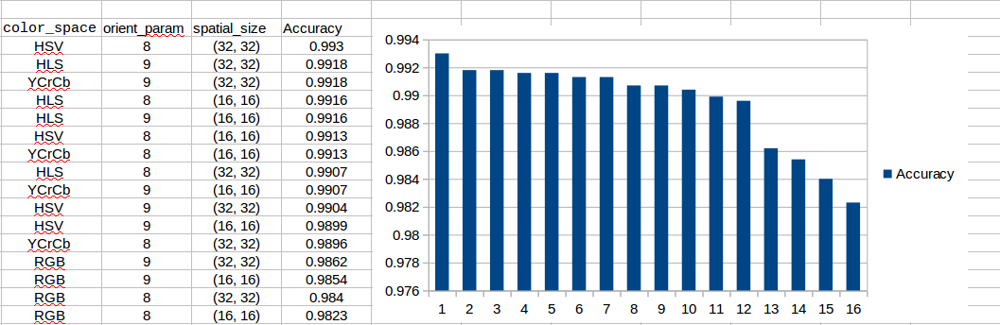

Accordingly I chose:
* color_space_param='YCrCb'
* spatial_size_param=(32, 32) # Spatial binning dimensions
* hist_bins_param=32 # 16    # Number of histogram bins
* orient_param=9
* pix_per_cell_param=8  #HOG
* cell_per_block_param=2  # HOG
* hog_channel_param= 'ALL'

The final model gives the following results:
* Test Accuracy of SVC =  0.9924
* Average prediction time:  0.001 Micro Seconds to predict a single image
* and it took 9.46 Seconds to train SVC
--------------------------------
## Sliding Window Search:
The code for this step is contained in the cells(11-12) of the IPython notebook

I created windows in our area of interest (ystart = 350, ystop = 656)

I used Udacity function that combines HOG feature extraction with sliding windows. This function extract HOG features for the entire image and then these features are sub-sampled according to which window we are in and then fed to the classifier.

I did some changes of this function to output both images and windows that I use later.

I used different window size at first to do detect both near and far cars.

But I realized that heatmap that I use later ensures that near vehicles is windowed
well.

Here are some example images:

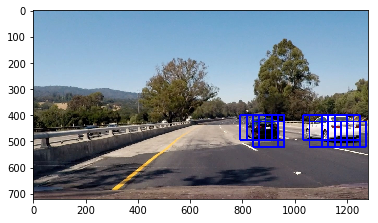
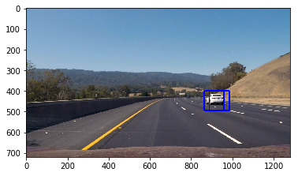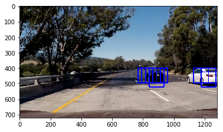
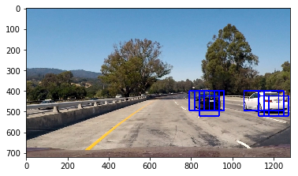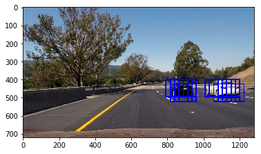

--------------------------------
## Improving Sliding Window Search:
The code for this step is contained in the cells(13) of the IPython notebook.

I overcame overlapping and false positive that using the following technique: heatmap and threshold:
* Combined heatmap and thresholding: Since true positive window number is large and false positive is so low, The function adds 1 to any pixel in a window so that it most probably lie above another window in case of true positive so there are at least two windows in the same place. But, in case of false positive , For sure there aren't any other window so there are less than 2 windows in the same place. If we took 2 as a threshold for no. of windows to consider a vehicle , it partially worked.

* Here are some test images after using heatmap:
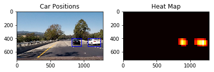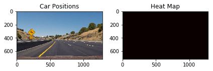
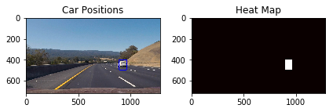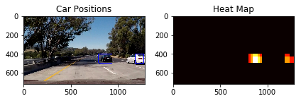
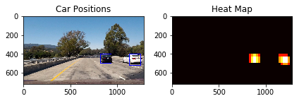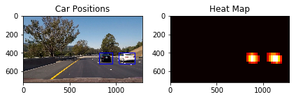
--------------------------------
## Video Implementation:
The code for this step is contained in the cells(13) of the IPython notebook.

I recorded the positions of positive detections in each frame of the video. From
the positive detections I created a heatmap and then thresholded that map to
identify vehicle positions. I then used `scipy.ndimage.measurements.label()` to
identify individual blobs in the heatmap. I then assumed each blob corresponded to
a vehicle. I constructed bounding boxes to cover the area of each blob detected.

The video is in the `./video_output` directory

--------------------------------
## Discussion:
There are still few false positives and true positives that are eliminated by the thresholding.

Some improvements:
* Augment the  training data ( flip images and different sizes ) so that the classifier do better. [I already tested flipping the images with no real improvements: `P5-Vehicle_detection-Flipped.ipynb`]
* Restrict the area of interest not to take false positives from the other road.
* HOG features extraction: Use combined color channels. We can use 4 different channels instead of 3.  E.g.: "Y", "Cr", "Cb", and "R".
* Try different classifiers (specially deep neural networks) or tune the SVC parameters.
* Implement multi-window sizes for different regions and increase the heat threshold.
* Most importantly, with the current dataset, as the accuracy of the prediction is very satisfactory (above 99%), get enough test images to test the different settings and do not rely on the accuracy alone.
